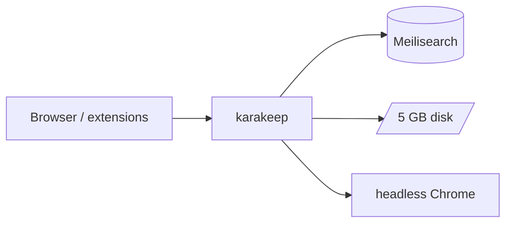

# Karakeep on Render

> Self-hosted bookmark-everything app: official Karakeep AIO image, Meilisearch full-text search, and headless Chrome for crawling.

[](https://render.com/deploy-template/api/github/start?template_repo=karakeep-render-template)

**Template repository:** [render-examples/karakeep-render-template](https://github.com/render-examples/karakeep-render-template)

Deploy [Karakeep](https://github.com/karakeep-app/karakeep) on Render without building the Turborepo monorepo. This template uses the official `ghcr.io/karakeep-app/karakeep` image, wires Meilisearch and headless Chrome on Render's private network, and generates auth secrets for you.


**At a glance:** ~$24–28/mo (Oregon, Starter plans) · first deploy ~5–10 min · **Starter** web plan · no LLM keys at Apply time

---

## Deploy

1. Click **[Deploy to Render](https://render.com/deploy-template/api/github/start?template_repo=karakeep-render-template)** and fork into your GitHub account.
2. On Apply, confirm `karakeep`, `meilisearch`, `chrome`, and both disks. Leave `OPENAI_API_KEY` empty.
3. Wait for **Live** (~5–10 min).
4. Open the **`karakeep`** web service URL and create your account.
5. Optional: set `OPENAI_API_KEY` on the **`karakeep`** service for AI tagging and summarization.

```bash
curl -sS https://<your-service>.onrender.com/api/health
# {"status":"ok"}
```

Docs: [docs.karakeep.app](https://docs.karakeep.app)

---

## What's included



| Resource | Plan | Role |
|----------|------|------|
| `karakeep` | Starter | Official AIO image + workers, SQLite on disk at `/data` |
| `meilisearch` | Starter | Full-text search (`getmeili/meilisearch`) |
| `chrome` | Starter | Crawling, screenshots, JS execution |
| `karakeep-data` | 5 GB disk | Bookmarks, assets, SQLite |
| `meilisearch-data` | 1 GB disk | Search index |

Default region: **oregon** (change in [`render.yaml`](./render.yaml)).

**Use it for:** read-it-later · link archiving · AI-tagged bookmarks · team lists · RSS hoarding

---

## Environment variables

**At Apply:** no secrets required.

**Auto-generated (do not rotate casually):**

| Variable | Purpose |
|----------|---------|
| `NEXTAUTH_SECRET` | Session signing |
| `MEILI_MASTER_KEY` | Shared Meilisearch auth (karakeep + meilisearch) |

**Wired for you:** `NEXTAUTH_URL`, `MEILI_ADDR`, `BROWSER_WEB_URL` (via private DNS host), `DATA_DIR`.

<details>
<summary>Blueprint defaults and optional overrides</summary>

Set in [`render.yaml`](./render.yaml):

| Variable | Value |
|----------|-------|
| `DATA_DIR` | `/data` |
| `MEILI_ADDR` | `http://meilisearch:7700` |
| `DB_WAL_MODE` | `true` |

Optional after deploy: `OPENAI_API_KEY`, `OLLAMA_BASE_URL`, and others listed in [.env.example](./.env.example) and [Karakeep env docs](https://docs.karakeep.app/configuration/environment-variables).

</details>

---

## Cost

| Resource | ~USD/mo |
|----------|--------:|
| `karakeep` (Starter) | 7 |
| `meilisearch` (Starter) | 7 |
| `chrome` (Starter) | 7 |
| 6 GB disks (5 + 1) | ~3 |
| **Total** | **~24–28** |

LLM usage is separate. Upgrade `karakeep` to **Standard** if you OOM on large imports or heavy crawling.

---

## Customize

- **Pin Karakeep version:** change the `FROM` tag in [`docker/Dockerfile.render-karakeep`](./docker/Dockerfile.render-karakeep), push, Sync Blueprint.
- **Custom domain:** add on the `karakeep` web service in the Dashboard (TLS automatic).
- **Disable signups:** set `DISABLE_SIGNUPS=true` on `karakeep` after creating your account.

**Ops:** Disk snapshots via Render. Logs: Dashboard → **karakeep** → **Logs**, or `render logs -r <id> --tail`. Disk = single instance only on the web service.

---

## Troubleshooting

| Problem | Fix |
|---------|-----|
| Chrome pserv exit 128 | Do not use `dockerCommand` on `runtime: image`. This template builds chrome from [`Dockerfile.render-chrome`](./docker/Dockerfile.render-chrome). |
| Crawling fails / no screenshots | Confirm `chrome` pserv is **Live**. Check `BROWSER_WEB_HOST` is set (entrypoint builds `BROWSER_WEB_URL`). |
| Search disabled | `MEILI_MASTER_KEY` must match on `karakeep` and `meilisearch` (shared env group handles this). |
| Login loops | Confirm `NEXTAUTH_URL` matches your public web URL (wired from `RENDER_EXTERNAL_URL`). |

More issues: [GitHub issues](https://github.com/render-examples/karakeep-render-template/issues) · upstream [Karakeep](https://github.com/karakeep-app/karakeep/issues)

---

## FAQ

**LLM keys at deploy?** No. Add `OPENAI_API_KEY` after sign-in if you want AI tagging.

**Fork manually?** No. One-click creates your fork.

**Free tier?** Starter paid plans required for web + two private services + disks.

**Same as Docker Compose?** Same three services; Render uses private DNS slugs instead of compose service names.

---

## Limits

- **Disk on web service** limits `karakeep` to one instance (no autoscaling)
- **Starter plan** may OOM on very large libraries; bump to Standard if needed
- **No bundled Ollama** in this template (add your own service if needed)
- **Same region** for all three services and disks

---

## Security & license

TLS at Render's edge. Protect `NEXTAUTH_SECRET` and `MEILI_MASTER_KEY`. Report upstream vulns to [karakeep-app/karakeep](https://github.com/karakeep-app/karakeep/security).

- **Karakeep:** [AGPL-3.0](https://github.com/karakeep-app/karakeep/blob/main/LICENSE)
